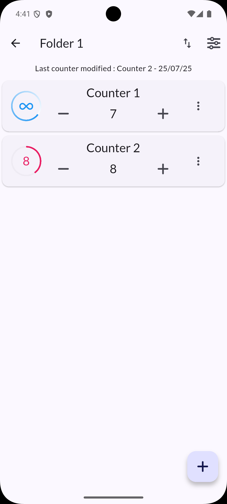
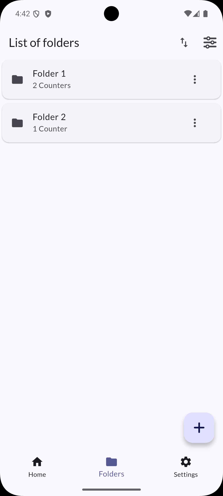
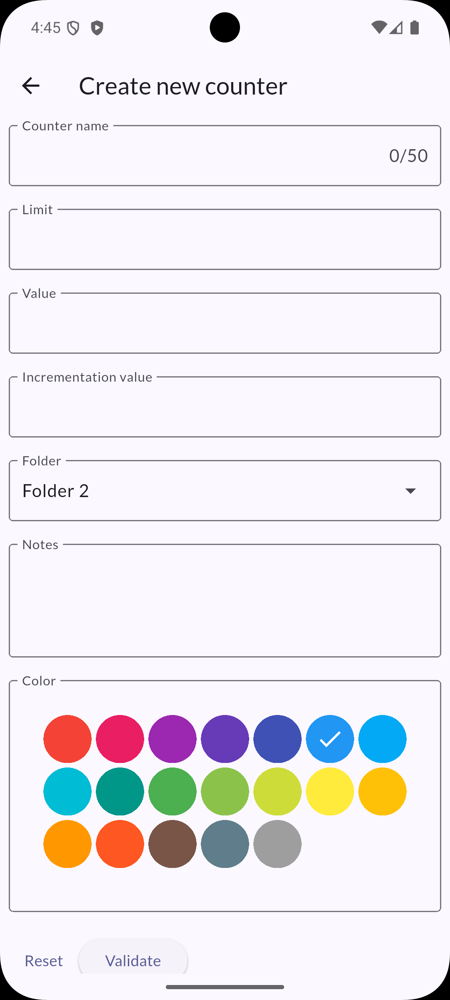

# Counter++

[](https://play.google.com/store/apps/details?id=com.bdzapps.counter.counter)

A powerful and intuitive counter application designed to assist with memorization through repetition. Counter++ helps you track your progress and organize your learning objectives with ease.

## Features

- **Simple infinite counter** - Count without limits
- **Custom counters** - Create your own counters tailored to your needs and objectives
- **Folder management** - Organize your counters into folders for better structure
- **Advanced statistics** - Track your memorization work with detailed analytics
- **Flexible organization** - Re-order counters and folders to match your workflow
- **JSON export** - Export your data in JSON format for backup or migration
- **Optional online synchronization** - Keep your data synchronized across devices (optional)

## Screenshots

<div align="center">
  
  
  
</div>

## About

This application was created to meet the need of a loved one to have an assistant for memorization. Indeed, one of the best ways to memorize is through repetition.

This is a leisure project developed with passion and care.

## Technical Information

### Internationalization (i18n)

To generate i18n labels, run:

```bash
flutter gen-l10n
```

### Android Version Support

This app requires Android SDK API version 30 or higher.

Configuration in `android/app/build.gradle`:

```gradle
minSdkVersion 30
```
